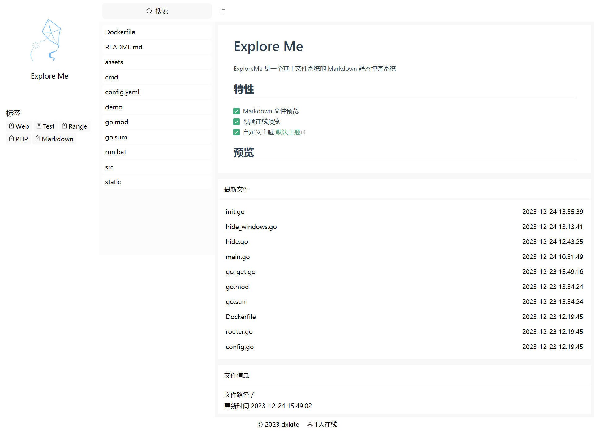

# Explore Me

ExploreMe 是一个基于文件系统的 Markdown 静态博客系统

## 特性

- [x] Markdown 文件预览
- [x] 视频在线预览
- [x] 自定义主题 [默认主题](https://github.com/dxkite/explorer-web)

## 使用

### 下载

在 release 下载最新的执行程序：https://github.com/dxkite/explore-me/releases

### 启动

在博客文件目录启动程序，访问 http://127.0.0.1 即可，默认会在启动目录下生成文件夹 `.explore-me`，里面包含默认配置以及执行的一些文件和主题配置。

### 主题替换

程序默认为单页应用，将要替换的主题文件放置在 web 目录下即可，默认 web 目录 `.explore-me/web`，主题参考：[默认主题](https://github.com/dxkite/explorer-web)

### 支持接口

支持接口参考主题项目：[传送门](https://github.com/dxkite/explorer-web/blob/master/src/src/api.ts)

## 预览

